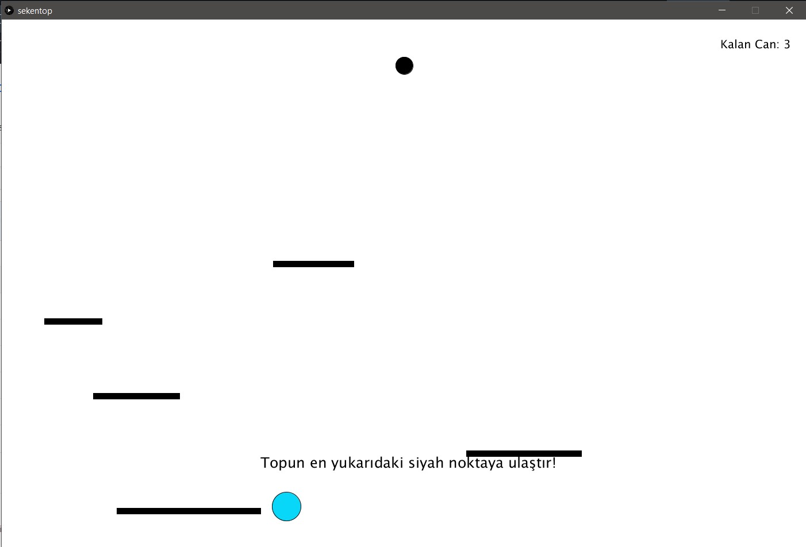
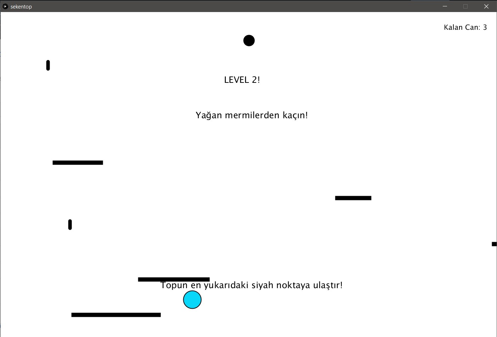
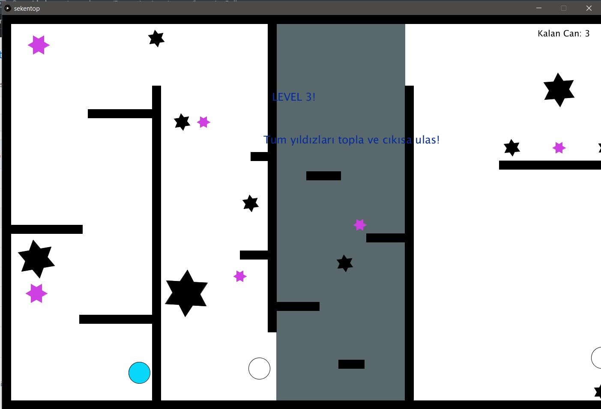
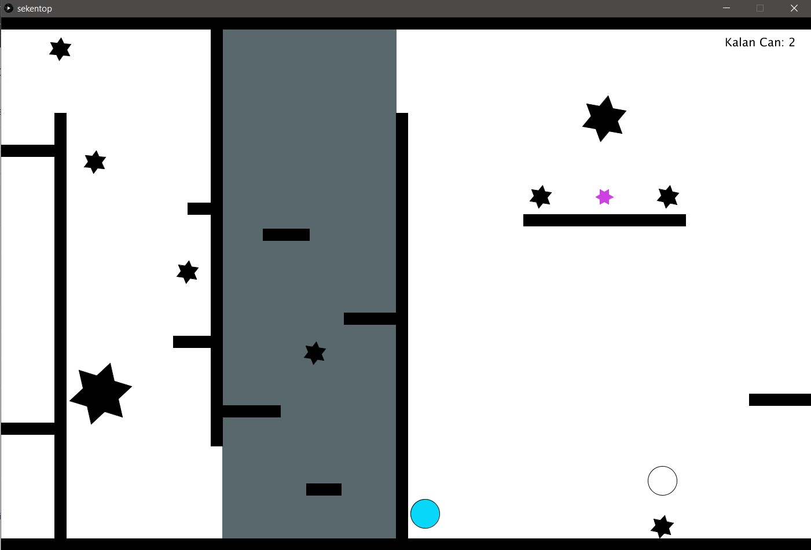
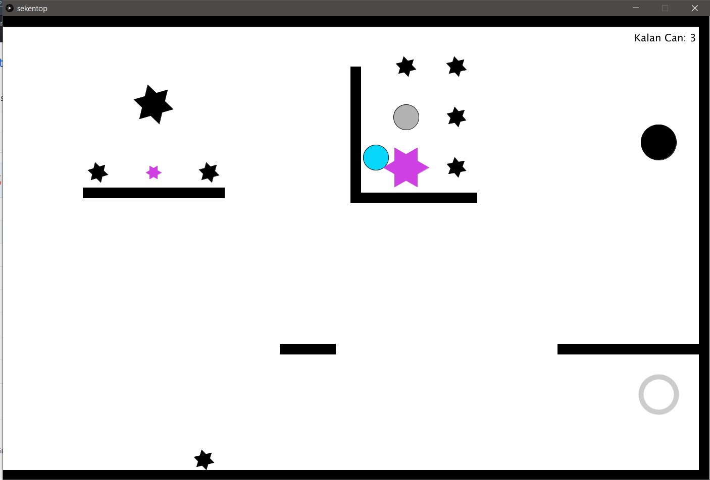

# Bouncing Ball

Bouncing ball game written in Java language using Processing. 

## Installation
 - Download [Processing](https://processing.org/download/)
 - Clone this repository


```bash
git clone https://github.com/muazdervent/Processing.git
```

## Usage

Open bouncingBall.pde with Processing ide and start play.

## In-game visuals








